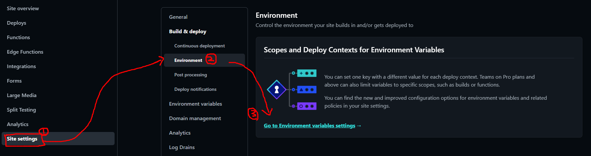
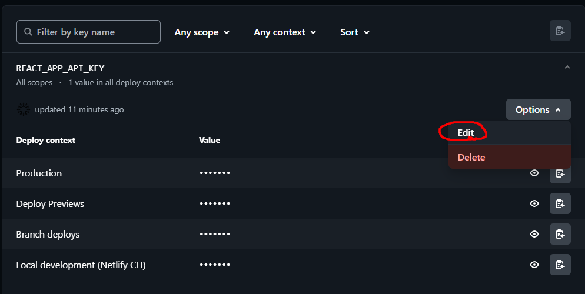

# Coin Ranking Site

## 시작하기

```jsx
npx create-react-app crypto-app --template typescript
```

## 패키지 설치

```jsx
npm i
@ant-design/icons
@reduxjs/toolkit
antd
axios
chart.js
html-react-parser
millify
moment
react-chartjs-2
react-redux
react-router-dom
```

## 사용한 api (Rapid API)

- \***\*Coinranking\*\***
- \***\*Bing News Search\*\***

## 환경변수 관리하기

1. .env 생성
2. REACT_APP 접두사 붙여서 변수 선언

```jsx
REACT_APP_API_KEY = api_key;
```

1. .gitignore에 .env 추가
2. api_key 사용하는 부분에, 원래 api_key 대신 process.env.REACT_APP_API_KEY 추가

## netlify에 배포시 환경변수 적용

### 배포할 때

- 초기 셋팅할 때 변수만들어서
- REACT_APP_API_KEY를 이름으로 하고 값을 api_key 값으로 셋팅하고 배포한다.

### 배포했을 때

- 사이트 배포한 곳으로 들어와서





- 후에 재배포

## 배포 url

- [https://coinranking.netlify.app/](https://coinranking.netlify.app/)
